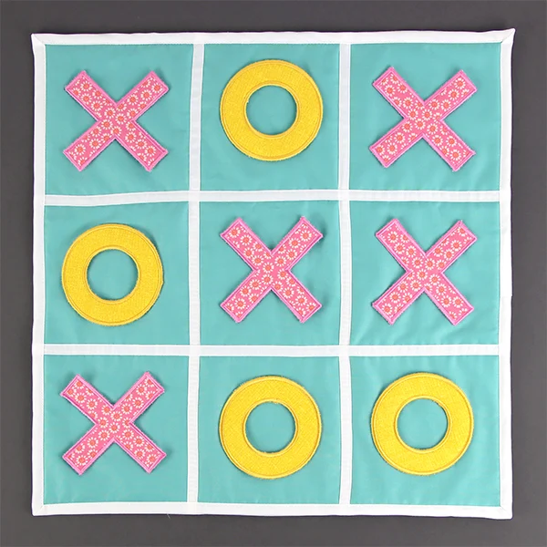

# GameSuk-
<!DOCTYPE html>
<html lang="en">
<head>
    <meta charset="UTF-8">
    <meta name="viewport" content="width=device-width, initial-scale=1.0">
    <title>GameSuk</title>
    <link rel="stylesheet" href="stonepaper.css">
</head>
<body>
    <h1>GameSuk</h1>
     
    

          

              
    

        

          
          <!-- 
Stone Paper
 -->
        

        

          
        

        
      

      

      
    
</body>
